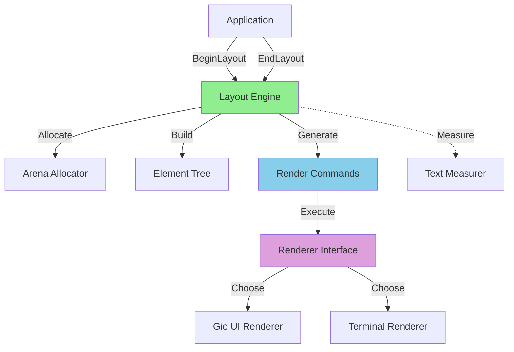
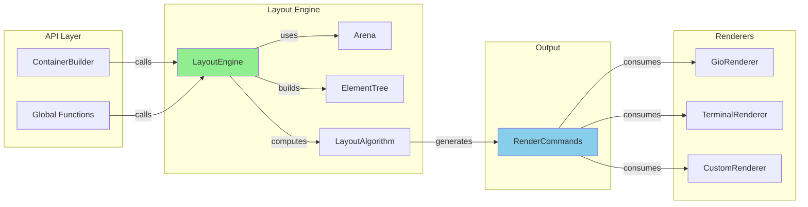
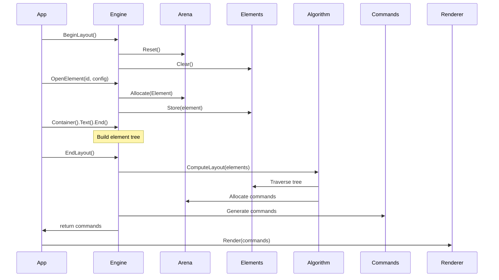
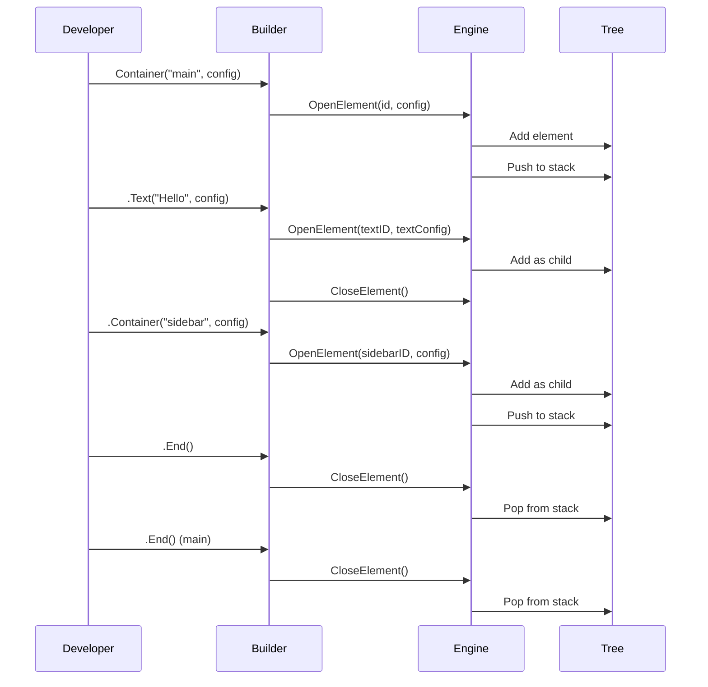

# Go-Clay Architecture Document

## Introduction

This document outlines the overall project architecture for Go-Clay, a pure Go implementation of the Clay layout library. Its primary goal is to serve as the guiding architectural blueprint for AI-driven development, ensuring consistency and adherence to chosen patterns and technologies.

**Relationship to Frontend Architecture:**
Go-Clay is a layout library, not an application with a UI. However, it enables UI development through renderers. The renderer implementations (e.g., Gio UI) handle the actual rendering of the layout commands output by the engine. This document focuses on the core layout engine architecture; renderer-specific details may be documented separately per renderer.

### Starter Template or Existing Project

This is NOT based on a starter template. Go-Clay is built from scratch, implementing the conceptual design and algorithms of the C Clay library in pure Go.

### Change Log

| Date | Version | Description | Author |
|------|---------|-------------|--------|
| 2024-01-XX | 1.0 | Initial architecture document | System |

## High Level Architecture

### Technical Summary

Go-Clay implements a two-phase layout engine architecture that separates computation from rendering, enabling pluggable render backends while maintaining microsecond-level performance. The core employs arena-based memory allocation for predictable memory usage and zero garbage collection pressure during layout computation. The design uses Go's strengths—type safety, interfaces, and composable structs—to provide an idiomatic API while replicating Clay C's algorithmic efficiency.

The system architecture is modular with clear boundaries: a pure layout engine (zero dependencies), a command-based output interface, and independent renderer implementations that consume commands. This separation enables multiple renderer backends (Gio UI, terminal, SDL, etc.) without coupling to any specific rendering technology.

### High Level Overview

**Architectural Style**: **Modular Library Architecture** with **Two-Phase Layout Pattern**

Go-Clay follows a two-phase layout pattern similar to the original Clay library:

1. **Declaration Phase**: Developers describe UI structure declaratively (ElementConfig trees)
2. **Computation Phase**: Engine computes positions, sizes, and render commands
3. **Output Phase**: Engine produces render commands (positioned primitives)
4. **Execution Phase**: Renderers execute commands against specific backends

**Repository Structure**: **Monorepo** with clear module boundaries:
- Core layout engine (`clay` package) - zero dependencies
- Renderer implementations (`renderers/*` packages) - backend-specific
- Examples (`examples/` directory) - demonstration applications
- Tests separate from examples

**Service Architecture**: **Embedded Component Architecture**

Go-Clay is a library, not a service. Applications import the package, instantiate a LayoutEngine, call BeginLayout()/EndLayout() per frame, and pass commands to a renderer. The engine maintains state (element tree, bounds, arena) but has no persistent service lifecycle.

**Primary User Interaction Flow**:

```
Application Frame Loop:
1. engine.BeginLayout()
2. clay.Container().Text().Container().End() [Declarative API]
3. commands := engine.EndLayout()
4. renderer.Render(commands)
```

The layout engine is stateless between BeginLayout()/EndLayout() calls, but maintains internal working state (element tree, arena allocations) during layout computation.

**Key Architectural Decisions**:

1. **Arena Allocation**: Predictable memory usage, no GC pressure during layout
2. **Command Output Pattern**: Decouples layout from rendering, enables multiple backends
3. **Fluent Builder Pattern**: Readable declarative API similar to React/JSX
4. **Interface-Based Design**: Pluggable text measurement, renderers
5. **Struct Composition**: Deeply configurable via embedded structs

### High Level Project Diagram



### Architectural and Design Patterns

**Arena Allocation Pattern**: Pre-allocated memory pool for zero-allocation layout computation
- **Rationale**: Eliminates GC pauses during layout, predictable memory usage, performance critical
- **Implementation**: sync.Mutex for thread safety, Reset() for frame reuse

**Command Pattern**: Layout outputs render commands consumed by renderers
- **Rationale**: Decouples layout logic from rendering, enables multiple backends, simplifies testing
- **Implementation**: RenderCommand struct with type discriminator and command-specific data

**Builder Pattern**: Fluent API for declarative layout construction
- **Rationale**: Improves readability, prevents common errors, enables method chaining
- **Implementation**: ContainerBuilder struct with chained methods returning self

**Dependency Injection**: Interfaces for text measurement and rendering
- **Rationale**: Testability, flexibility, enables mock implementations
- **Implementation**: TextMeasurer interface, Renderer interface (to be defined)

**Two-Phase Layout Pattern**: Separate declaration and computation phases
- **Rationale**: Enables optimization, caching, incremental updates (future)
- **Implementation**: BeginLayout() builds element tree, EndLayout() computes and outputs commands

**Element Tree Pattern**: Hierarchical parent-child element structure
- **Rationale**: Natural representation of layouts, efficient traversal for layout computation
- **Implementation**: Element struct with Parent/Children fields, ElementID-based tree

## Tech Stack

### Cloud Infrastructure

- **Provider**: N/A (library, not a service)
- **Key Services**: N/A
- **Deployment Regions**: N/A

### Technology Stack Table

| Category | Technology | Version | Purpose | Rationale |
|----------|-----------|---------|---------|-----------|
| Language | Go | 1.23.8 | Primary development language | Type safety, performance, simplicity |
| Toolchain | Go | 1.24.3 | Compiler and tooling | Latest stable version |
| Core Library | Standard Library Only | N/A | Zero external dependencies | Simplicity, portability |
| Renderer | Gio UI | v0.9.0 | Primary rendering backend | Native Go, cross-platform, active |
| Text Shaping | github.com/go-text/typesetting | v0.3.0 | Text measurement (indirect) | Gio dependency, not direct |
| Testing | testify/assert | latest | Test assertions | Industry standard, expressive |
| Benchmarking | testing.B | built-in | Performance testing | Standard library, no deps |
| Memory Profiling | pprof | built-in | Performance analysis | Standard Go tooling |
| Documentation | godoc | built-in | API docs | Standard tooling |
| Linting | golangci-lint | latest | Code quality | Optional, common tool |
| Version Control | Git | N/A | Source control | Industry standard |
| CI/CD | GitHub Actions | N/A | Automation | Free for open source |

## Data Models

### Element

**Purpose**: Represents a single UI element in the layout tree with configuration and computed state.

**Key Attributes**:
- **ID**: ElementID - Unique identifier
- **Config**: ElementDeclaration - User-provided configuration (sizing, colors, text, etc.)
- **Parent**: ElementID - Parent element reference (0 = root)
- **Children**: []ElementID - Child element IDs
- **Bounds**: BoundingBox - Computed position and size
- **ComputedSize**: Dimensions - Computed width and height
- **ZIndex**: int16 - Layering order
- **IsFloating**: bool - Floating element flag
- **IsClipping**: bool - Clipping element flag

**Relationships**:
- Parent → Children: One-to-many (tree structure)
- Element → RenderCommands: One-to-many (element may produce multiple commands)

### ElementDeclaration / ElementConfig

**Purpose**: User-provided configuration for creating an element.

**Key Attributes**:
- **ID**: ElementID - Explicit ID (or auto-generated)
- **Layout**: LayoutConfig - Sizing, padding, direction, alignment
- **BackgroundColor**: Color - Fill color
- **Border**: BorderConfig - Border styling (optional)
- **CornerRadius**: CornerRadius - Corner rounding (four values)
- **Text**: TextConfig - Text content and styling (optional)
- **Image**: ImageConfig - Image data and styling (optional)
- **Floating**: FloatingConfig - Floating element behavior (optional)
- **Clip**: ClipConfig - Clipping behavior (optional)
- **AspectRatio**: float32 - Aspect ratio constraint
- **UserData**: interface{} - Custom data for applications

**Relationships**:
- Used by: Element.Config
- Contains: LayoutConfig, BorderConfig, TextConfig, etc.

### RenderCommand

**Purpose**: Output primitive representing a single render operation.

**Key Attributes**:
- **BoundingBox**: BoundingBox - Position and size for rendering
- **CommandType**: RenderCommandType - Type discriminator
- **ZIndex**: int16 - Rendering order
- **ID**: ElementID - Source element ID
- **Data**: interface{} - Type-specific command data

**Relationships**:
- Generated by: EndLayout() method
- Consumed by: Renderer implementations

### BoundingBox

**Purpose**: Rectangle bounds for positioning and clipping.

**Key Attributes**:
- **X**: float32 - Left edge position
- **Y**: float32 - Top edge position
- **Width**: float32 - Rectangle width
- **Height**: float32 - Rectangle height

**Relationships**:
- Used by: Element.Bounds, RenderCommand.BoundingBox

### LayoutStats

**Purpose**: Performance metrics for monitoring and optimization.

**Key Attributes**:
- **ElementCount**: int - Total elements in tree
- **RenderCommands**: int - Total commands generated
- **LayoutTime**: int64 - Layout computation time (nanoseconds)
- **MemoryUsed**: int - Arena memory used (bytes)

**Relationships**:
- Provided by: LayoutEngine.GetStats()

## Components

### LayoutEngine (Core Engine)

**Responsibility**: Manages layout lifecycle, element tree construction, and layout computation.

**Key Interfaces**:
- `BeginLayout()` - Start layout phase, reset state
- `EndLayout() []RenderCommand` - Complete layout, return commands
- `OpenElement(id ElementID, config ElementDeclaration)` - Add element to tree
- `CloseElement()` - Close current element
- `SetPointerState(pos Vector2, pressed bool)` - Update pointer state
- `SetLayoutDimensions(dimensions Dimensions)` - Set available space
- `GetElementBounds(id ElementID) (BoundingBox, bool)` - Query computed bounds
- `GetStats() LayoutStats` - Get performance metrics

**Dependencies**: Arena, Element storage map, Text measurer

**Technology Stack**: Pure Go, no external dependencies

### Arena (Memory Manager)

**Responsibility**: Provides arena-based memory allocation for predictable, GC-free memory usage.

**Key Interfaces**:
- `NewArena(capacity int) *Arena` - Create arena
- `Allocate(size int) []byte` - Allocate memory
- `Reset()` - Clear arena for reuse
- `Used() int` - Get used memory
- `Available() int` - Get available memory

**Dependencies**: None

**Technology Stack**: Pure Go, sync.Mutex for thread safety

### ContainerBuilder (Fluent API)

**Responsibility**: Provides fluent, declarative API for building layouts.

**Key Interfaces**:
- `Container(id ElementID, config ElementDeclaration) *ContainerBuilder`
- `Text(text string, config TextConfig) *ContainerBuilder`
- `Image(config ImageConfig) *ContainerBuilder`
- `End()`

**Dependencies**: LayoutEngine (global state)

**Technology Stack**: Pure Go, method chaining pattern

### Gio UI Renderer (Renderer Implementation)

**Responsibility**: Renders commands using Gio UI backend following Clay C architecture.

**Key Interfaces**:
- `NewRenderer() *GioRenderer`
- `Render(commands []RenderCommand)` - Unified method matching Clay C pattern
- `BeginFrame()`, `EndFrame()`, `SetViewport()` - Lifecycle methods

**Architecture**: Implements unified command processing where each RenderCommand contains both bounds (for positioning) and styling data, matching the proven Clay C renderer pattern.

**Dependencies**: gioui.org v0.9.0

**Technology Stack**: Go, Gio UI framework

### TextMeasurer (Interface)

**Responsibility**: Measures text dimensions for layout computation.

**Key Interfaces**:
- `MeasureText(text string, config TextConfig) Dimensions`
- `GetTextMetrics(fontID uint16, fontSize float32) TextMetrics`

**Dependencies**: None (interface)

**Technology Stack**: To be implemented (may use Gio text shaping)

## Component Diagrams



## External APIs

No external APIs required. The library operates as an embedded component.

## Core Workflows

### Layout Computation Workflow



### Element Tree Construction Workflow



## REST API Spec

Not applicable - library, not a service.

## Database Schema

Not applicable - no persistent storage.

## Source Tree

```
go-clay/
├── clay.go                  # Core API, element configs, helpers
├── layout_engine.go         # LayoutEngine implementation
├── renderer.go              # Renderer interface definition
├── go.mod                   # Go module definition
├── go.sum                   # Dependency checksums
│
├── renderers/               # Renderer implementations
│   ├── gioui/
│   │   ├── gioui_renderer_v0.9.0.go
│   │   └── README_v0.9.0.md
│   ├── terminal/           # Future
│   ├── sdl/                # Future
│   └── opengl/             # Future
│
├── docs/                   # Documentation
│   ├── README.md
│   ├── api-reference.md
│   ├── layout-system.md
│   ├── examples.md
│   ├── performance.md
│   ├── renderer-guide.md
│   ├── brief.md            # Project brief
│   ├── prd.md              # Product requirements
│   └── architecture.md     # This document
│
├── examples/              # Example applications
│   ├── simple/           # Basic usage
│   ├── complex/          # Advanced layouts
│   └── gioui-integration/ # Full Gio UI app
│
└── tests/                 # Test suites
    ├── layout_test.go
    ├── arena_test.go
    ├── bench_test.go
    └── integration_test.go
```

## Infrastructure and Deployment

### Infrastructure as Code

- **Tool**: N/A (library, not deployed infrastructure)
- **Location**: N/A
- **Approach**: N/A

### Deployment Strategy

- **Strategy**: GitHub releases for distribution, go get for installation
- **CI/CD Platform**: GitHub Actions
- **Pipeline Configuration**: `.github/workflows/ci.yml`

### Environments

- **Development**: Local Go development environment
- **Testing**: GitHub Actions CI with matrix testing (Go versions, platforms)
- **Releases**: GitHub releases tagged with semantic versioning

### Environment Promotion Flow

```
Development → Commit → GitHub Actions → Test Suite → (Success) → Release Tag → GitHub Release
```

### Rollback Strategy

- **Primary Method**: Git revert + new release tag
- **Trigger Conditions**: Breaking changes, performance regressions, critical bugs
- **Recovery Time Objective**: <1 hour for patch releases

## Error Handling Strategy

### General Approach

- **Error Model**: Explicit error returns for operations that can fail
- **Exception Hierarchy**: N/A (no exceptions in Go)
- **Error Propagation**: Return error values from functions, check at call sites

### Logging Standards

- **Library**: N/A (library doesn't log, applications do)
- **Format**: N/A
- **Levels**: N/A
- **Required Context**:
  - Library doesn't log
  - Applications using the library handle logging

### Error Handling Patterns

#### Layout Errors

- **Panic on Programming Errors**: Invalid API usage (e.g., EndLayout() without BeginLayout()) panics
- **Graceful Degradation**: Layout engine completes computation even with invalid configurations (clamps to valid ranges)
- **Bounds Checking**: All array/map accesses checked to prevent panics

#### Arena Errors

- **Arena Overflow**: Allocate() returns nil if arena is full
- **Reset Required**: Clear errors between BeginLayout() calls
- **Validation**: Check arena size on creation

#### Render Errors

- **Renderer Responsibility**: Renderers handle their own errors (not core responsibility)
- **Command Validation**: Core provides well-formed commands, renderers validate

## Coding Standards

### Core Standards

- **Languages & Runtimes**: Go 1.23.8, Go 1.24.3 toolchain
- **Style & Linting**: gofmt for formatting, golangci-lint for analysis (optional)
- **Test Organization**: `*_test.go` files colocated with source

### Naming Conventions

Following Go standard library conventions:
- Exported types and functions: PascalCase
- Unexported: camelCase
- Constants: CamelCase or CamelCase_UPPER
- Interface names: -er suffix (e.g., Renderer, Measurer)

### Critical Rules

- **Never use unsafe package**: Memory safety guaranteed
- **Never panic in production paths**: Panic only for programming errors (wrong API usage)
- **Always validate inputs**: Bounds checking, nil checks, valid ranges
- **Zero dependencies in core**: Standard library only in clay package
- **Thread safety**: Arena uses sync.Mutex for concurrent access
- **Memory efficiency**: Use arena allocation, avoid repeated allocations
- **API stability**: No breaking changes in 1.x versions

### Language-Specific Guidelines

- **Go Specifics**:
  - Use `context.Context` for cancellation (future enhancement)
  - Use `sync` primitives appropriately (already using sync.Mutex)
  - Leverage zero values where useful
  - Use struct embedding for composition

## Test Strategy and Standards

### Testing Philosophy

- **Approach**: Test-Driven Development where practical, comprehensive test coverage
- **Coverage Goals**: >90% for core layout engine
- **Test Pyramid**: 70% unit tests, 20% integration tests, 10% benchmarks

### Test Types and Organization

#### Unit Tests

- **Framework**: Go testing package (standard library)
- **File Convention**: `*_test.go` colocated with source
- **Location**: Same package as source
- **Mocking Library**: No mocking needed (pure functions and structs)
- **Coverage Requirement**: >90% for all public APIs

**AI Agent Requirements**:
- Generate tests for all public methods
- Cover edge cases: empty layouts, single element, very large layouts
- Test all sizing combinations (Fit, Grow, Percent, Fixed)
- Verify arena behavior: allocation, reset, overflow
- Test error conditions and bounds

#### Integration Tests

- **Scope**: Layout engine with renderer (Gio UI)
- **Location**: `examples/` directory with testable examples
- **Test Infrastructure**:
  - **Gio UI**: Headless testing or visual regression
  - **Performance**: Benchmark suite comparing against C implementation

#### End-to-End Tests

- **Framework**: Example applications act as E2E tests
- **Scope**: Complete application using Go-Clay
- **Environment**: Local and CI via example applications
- **Test Data**: Example layouts in `examples/` directory

### Test Data Management

- **Strategy**: Table-driven tests with fixtures
- **Fixtures**: Test fixtures in `tests/fixtures/` for complex layouts
- **Factories**: Helper functions for creating test elements
- **Cleanup**: Arena Reset() between tests ensures clean state

### Continuous Testing

- **CI Integration**: GitHub Actions runs all tests on push
- **Performance Tests**: Benchmark suite runs in CI, tracks regressions
- **Security Tests**: N/A (no external inputs or network)

## Security

### Input Validation

- **Validation Library**: Standard library validation
- **Validation Location**: Public API entry points
- **Required Rules**:
  - Validate ElementID values (non-zero)
  - Validate BoundingBox dimensions (positive width/height)
  - Clamp color values to 0.0-1.0 range
  - Validate array indices before access

### Authentication & Authorization

- **Auth Method**: N/A (library, not a service)
- **Session Management**: N/A
- **Required Patterns**: N/A

### Secrets Management

- **Development**: N/A
- **Production**: N/A
- **Code Requirements**: N/A

### API Security

- **Rate Limiting**: N/A
- **CORS Policy**: N/A
- **Security Headers**: N/A
- **HTTPS Enforcement**: N/A

### Data Protection

- **Encryption at Rest**: N/A (no persistent data)
- **Encryption in Transit**: N/A
- **PII Handling**: N/A
- **Logging Restrictions**: Library doesn't log

### Dependency Security

- **Scanning Tool**: `go list -json -m all` + `nancy` or GitHub Dependabot
- **Update Policy**: Regular updates to patch versions, careful major version upgrades
- **Approval Process**: Dependabot PR review for dependency updates

### Security Testing

- **SAST Tool**: golangci-lint with gosec
- **DAST Tool**: N/A
- **Penetration Testing**: N/A (library, not network-exposed service)

## Checklist Results Report

Checklist results will be populated here after running architect-checklist.

## Next Steps

After completing the architecture:

1. **Begin MVP Implementation**:
   - Start with TDD approach for core layout engine
   - Implement arena allocation first
   - Build element tree construction
   - Implement layout computation algorithm
   - Create render command generation
   - Implement Gio UI renderer

2. **Performance Benchmarking**:
   - Establish baseline benchmarks against C implementation
   - Track performance metrics through development
   - Optimize hot paths identified in profiling

3. **Documentation**:
   - Write getting started guide
   - Document API with examples
   - Create example applications

4. **Community**:
   - Share project with Go community
   - Gather early adopter feedback
   - Iterate on API based on feedback

